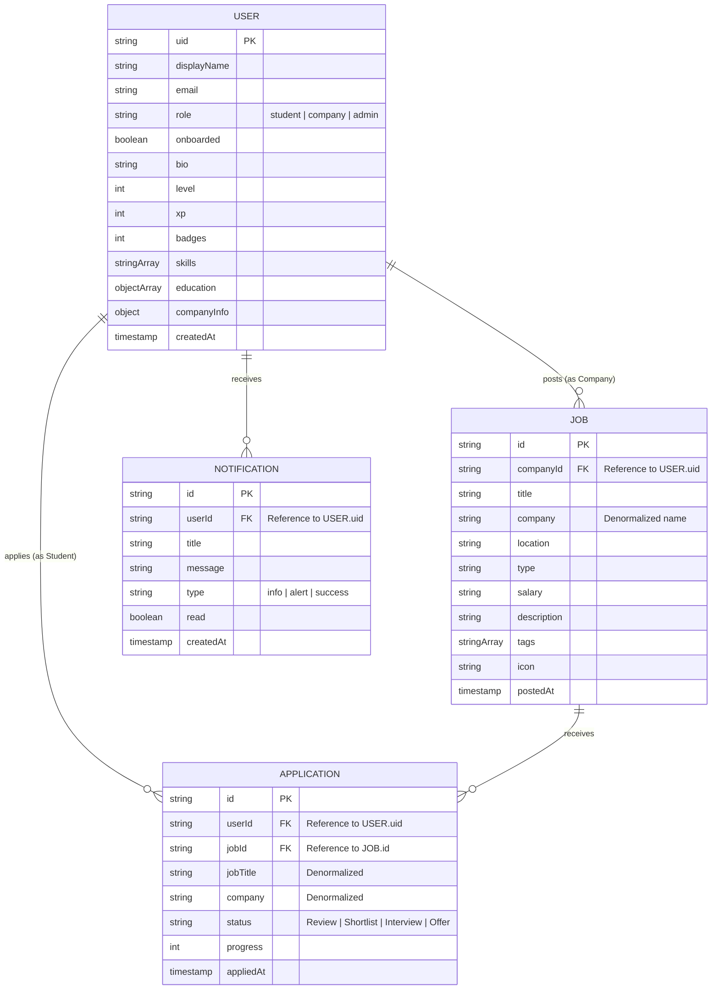

# Entity Relationship Diagram (ERD)

This document describes the data structure and relationships for the **Sarawak Smart Connect** platform.

### 📋 Entity Descriptions

#### 1. User
The core entity representing all participants in the network. Roles determine high-level permissions and features:
- **Students**: Can search for jobs, apply, and track progress.
- **Companies**: Can post jobs and manage recruiting.
- **Admins**: Have broad oversight and system configuration access.

#### 2. Job
Representing professional opportunities. While it contains denormalized company names for performance, it is structurally linked to a User document with the `company` role.

#### 3. Application
A join entity that links a Student to a Job. It maintains stateful information about the hiring process (status, progress percentage).

#### 4. Notification
System-generated alerts that are targeted at specific users based on events (e.g., job application status updates).
